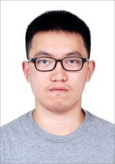

# 陆青阳 Lu Qingyang

男，2001年1月生，来自江苏苏州

博士研究生

专业：数学  研究方向：计算数学

清华大学 数学科学系

Github:[https://github.com/LuOH3](https://github.com/LuOH3)

Email:luqingyang123@126.com

---
### 教育经历

2016.9--2019.6 江苏省苏州中学 高中

2019.9--2023.6 南京大学 信息与计算科学 本科

2023.9-- 清华大学 数学 博士研究生

---
### 科研

正在努力

---
### 学科竞赛

第十二届全国大学生数学竞赛决赛（数学类低年级）二等奖

第十二届全国大学生数学竞赛（江苏赛区）数学类一等奖

第47届ICPC国际大学生程序设计竞赛亚洲区域赛（合肥）金奖

第47届ICPC国际大学生程序设计竞赛亚洲区域赛（沈阳）银奖

第46届ICPC国际大学生程序设计竞赛亚洲区域赛（沈阳）银奖

第46届ICPC国际大学生程序设计竞赛亚洲区域赛（南京）铜奖

2021CCPC中国大学生程序设计竞赛（哈尔滨）银奖

2022CCPC中国大学生程序设计竞赛（广州）铜奖

2023江苏省大学生程序设计竞赛金奖

2022江苏省大学生程序设计竞赛金奖

2021江苏省大学生程序设计竞赛银奖

---
### 荣誉奖项

2021 国家奖学金

2020、2022 人民奖学金一等奖

2020 南京大学基础学科拔尖计划专项奖学金特等奖

2021、2022 南京大学基础学科拔尖计划专项奖学金优秀奖

---
### 其他经历

2021.3-2022.2 华东五校“AI+X"微专业课程结业

2019.9-2023.6 南京大学计算机科学与技术专业辅修结业

2022.9-2023.7 北京大学重庆大数据研究院有限元算法实习生